# Система ежедневных библейских активностей для молодежи

## Полное описание функционала и ценности приложения

---

## Содержание

1. [Введение и назначение системы](#1-введение-и-назначение-системы)
2. [Ценность для христианской молодежи](#2-ценность-для-христианской-молодежи)
3. [Роли пользователей](#3-роли-пользователей)
4. [Архитектура системы](#4-архитектура-системы)
5. [User Journey Maps](#5-user-journey-maps)
6. [Описание функционала по экранам](#6-описание-функционала-по-экранам) ([6.0 Wireframes для каждой страницы](#60-wireframes-для-каждой-страницы))
7. [Ежедневный отчет лидеру](#7-ежедневный-отчет-лидеру-daily-digest)
8. [Полный цикл одного дня](#8-полный-цикл-одного-дня-в-системе)
9. [Принципы использования системы](#9-принципы-использования-системы)
10. [Ожидаемые результаты внедрения](#10-ожидаемые-результаты-внедрения)

---

## 1. Введение и назначение системы

### Проблема

Одной из ключевых трудностей в работе с христианской молодежью является формирование устойчивой привычки регулярного чтения Библии и осмысленной духовной жизни. Молодые люди часто мотивированы на воскресном служении, но в течение недели теряют ритм: забывают читать, не знают, с чего начать, не видят прогресса, не чувствуют поддержки.

Молодежные лидеры, в свою очередь, не имеют инструмента, чтобы видеть реальную картину: кто читает, кто испытывает трудности, кому нужна помощь. Часто это становится известно слишком поздно -- когда человек уже отдалился.

### Миссия приложения

Данное приложение создается как цифровой инструмент поддержки молодежи в формировании регулярной духовной жизни через:

- ежедневное чтение Библии,
- размышление над прочитанным,
- личную молитву,
- осмысление Божьего Слова,
- проверку понимания текста через тесты.

**Главная цель системы -- помочь сформировать устойчивую привычку ежедневного общения со Словом Божьим**, а не контролировать или оценивать духовность человека.

### Почему цифровой инструмент

Молодежь живет в цифровом мире. Смартфон -- первое, что они берут в руки утром. Вместо того чтобы бороться с этим, мы используем это: приложение становится мостом между привычной средой молодого человека и его духовной жизнью. Напоминание на телефоне, простой интерфейс, несколько минут в день -- и Божье Слово становится частью повседневности, а не только воскресного служения.

---

## 2. Ценность для христианской молодежи

### 2.1 Формирование привычки

Молодым людям сложно удерживать регулярность без структуры. Система создает простой ежедневный ритм:

> **Прочитал -- подумал -- записал -- помолился -- проверил себя.**

Этот цикл помогает перейти от случайного чтения к осознанному. Исследования показывают, что для формирования привычки необходима регулярность, простота и обратная связь -- система обеспечивает все три элемента.

### 2.2 Личное размышление вместо формальности

Задания требуют краткого ответа своими словами. Это не формальная галочка, а реальная работа ума и сердца:

- **учиться размышлять** -- формулировать мысли по прочитанному,
- **находить применение** -- видеть, как текст связан с реальной жизнью,
- **слышать Бога** -- записывать, что Бог говорит лично через текст.

Это формирует навык самостоятельного изучения Библии, который останется с человеком на всю жизнь.

### 2.3 Поддержка, а не контроль

Лидер видит активность участников и может:

- **поддержать тех, кто выпадает** -- вовремя написать, позвонить, предложить помощь,
- **увидеть трудности** -- если участник регулярно пропускает определенные задания, это сигнал,
- **корректировать обучение** -- если тесты показывают слабое понимание, можно уделить теме больше внимания.

Система не сравнивает участников между собой. Нет рейтингов, нет публичных таблиц. Только лидер видит общую картину.

### 2.4 Видимый духовный путь

Со временем у участника накапливается личный архив:

- записанных мыслей и наблюдений,
- выводов и молитвенных заметок,
- результатов тестов.

Это позволяет оглянуться назад и увидеть свой духовный рост. Такой архив становится ценным свидетельством Божьей работы в жизни.

### 2.5 Общность и подотчетность

Участники знают, что они не одни в этом пути. Принадлежность к группе создает здоровую подотчетность: не ради давления, а ради взаимной поддержки. Когда молодой человек знает, что лидер заботится и обращает внимание -- это мотивирует.

### 2.6 Инструмент заботы для лидера

Для молодежного лидера приложение -- это не система слежки, а **инструмент пасторской заботы**. Вместо того чтобы гадать, как дела у каждого, лидер получает объективную картину и может направить свое внимание туда, где оно нужнее всего.

---

## 3. Роли пользователей

### Описание ролей

| Роль | Описание | Основные возможности |
|------|----------|---------------------|
| **Участник (Student)** | Молодой человек, выполняющий задания | Выполнение заданий, прохождение тестов, просмотр календаря |
| **Лидер (Leader)** | Молодежный лидер группы | Создание заданий и тестов, просмотр аналитики, получение отчетов |
| **Администратор (Admin)** | Управляющий структурой | Создание групп, назначение лидеров, добавление участников |
| **Суперадминистратор (Superadmin)** | Полный доступ | Управление всей системой и администраторами |

### Иерархия ролей

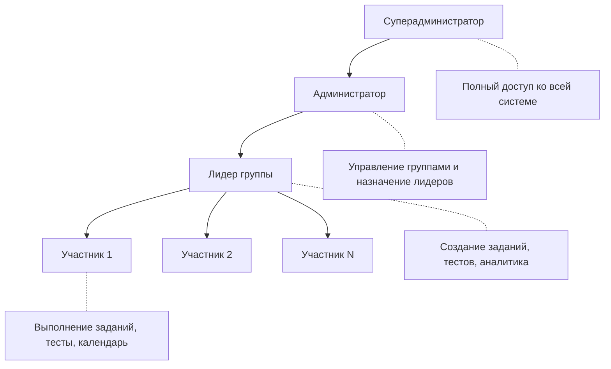

### Правила безопасности

1. Пользователь может видеть только данные своей группы.
2. Все проверки прав выполняются на сервере.
3. Доступ к данным никогда не определяется только интерфейсом.

---

## 4. Архитектура системы

### Высокоуровневая структура

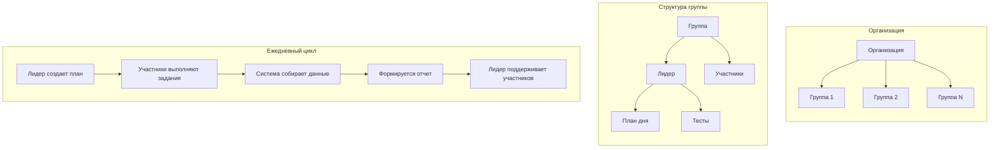

### Ежедневный информационный поток

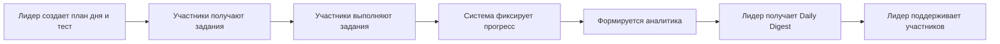

---

## 5. User Journey Maps

### 5.1 Путь участника (Student Journey)

Типичный день участника в системе:

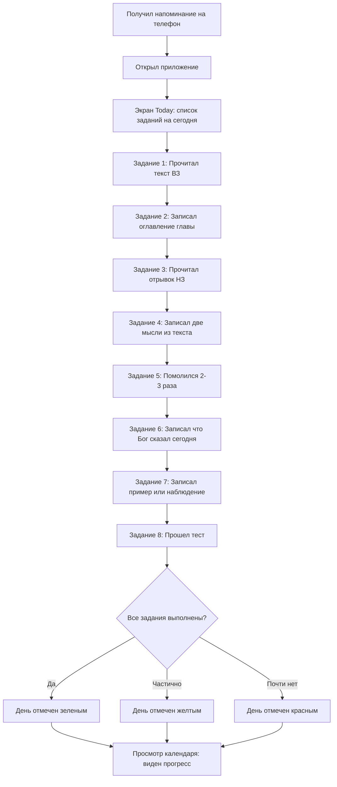

**Ожидаемый результат для участника:**

- Короткое ежедневное действие (10-15 минут).
- Отсутствие перегрузки: задания простые и понятные.
- Ощущение завершенности дня.
- Наглядная обратная связь через цветовую систему.

---

### 5.2 Путь лидера (Leader Journey)

Ежедневный цикл работы лидера:

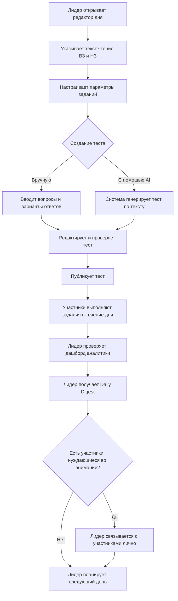

**Ожидаемый результат для лидера:**

- Понимание состояния группы без необходимости спрашивать каждого.
- Возможность вовремя помочь тем, кто испытывает трудности.
- Экономия времени на рутинном контроле.
- Фокус на личном общении и поддержке.

---

### 5.3 Путь администратора (Admin Journey)

Настройка и управление системой:

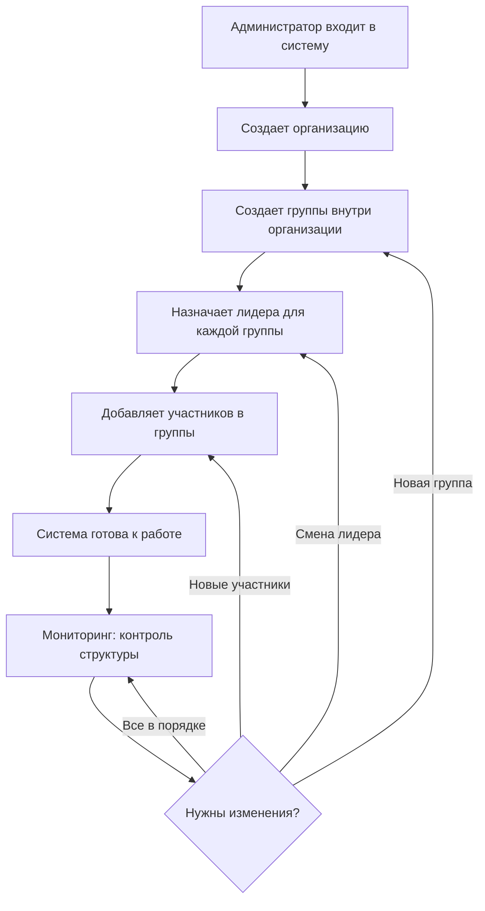

**Ожидаемый результат для администратора:**

- Быстрая настройка структуры церкви/объединения.
- Гибкое управление группами и лидерами.
- Простой процесс добавления новых участников.

---

## 6. Описание функционала по экранам

---

### 6.0 Wireframes для каждой страницы

Ниже приведены wireframes (mermaid-диаграммы) для каждой страницы приложения: сводка по экранам участника, лидера и администратора.

| Страница | Роль | Описание |
|----------|------|----------|
| Сегодня | Участник | Задания текущего дня |
| Календарь | Участник | Регулярность выполнения по дням |
| Тест | Участник | Вопрос с вариантами ответа |
| Редактор дня | Лидер | План заданий на дату |
| Редактор тестов | Лидер | Создание теста вручную или через AI |
| Дашборд аналитики | Лидер | Состояние группы и метрики |
| Панель администратора | Администратор | Организации, группы, пользователи |

#### 6.0.1 Сегодня

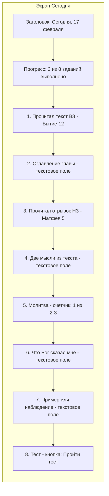

#### 6.0.2 Календарь

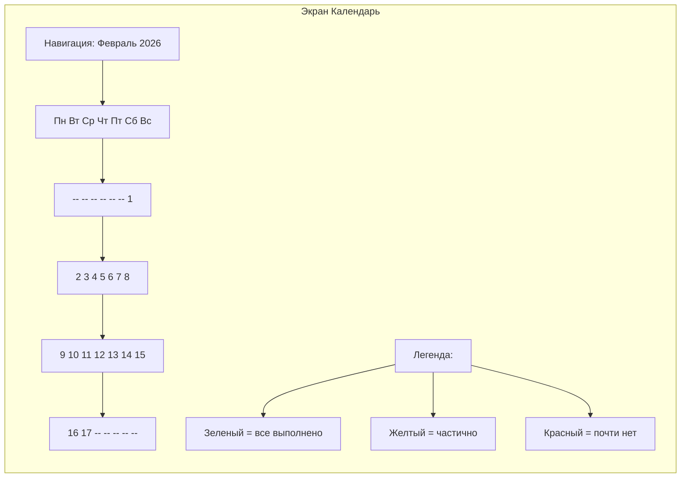

#### 6.0.3 Тест

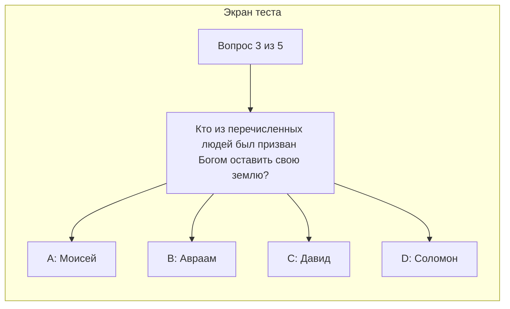

#### 6.0.4 Редактор дня

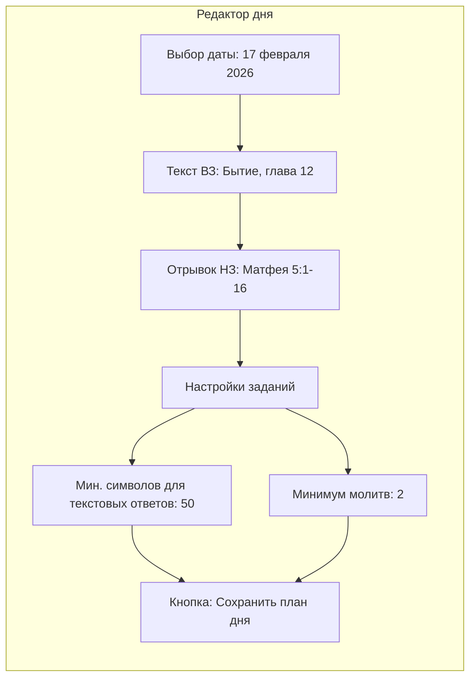

#### 6.0.5 Редактор тестов

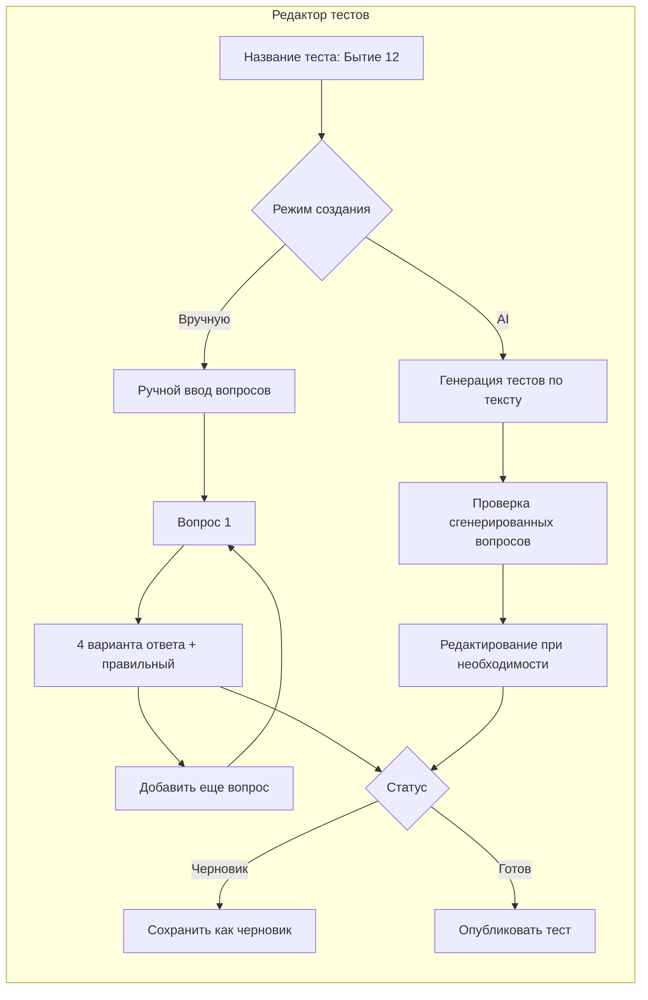

#### 6.0.6 Дашборд аналитики

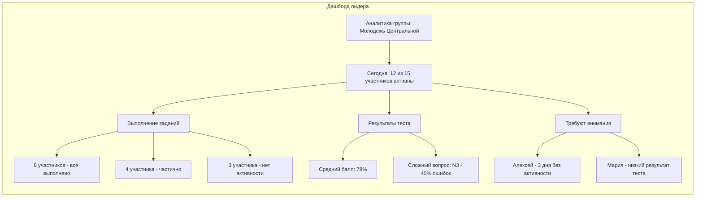

#### 6.0.7 Панель администратора

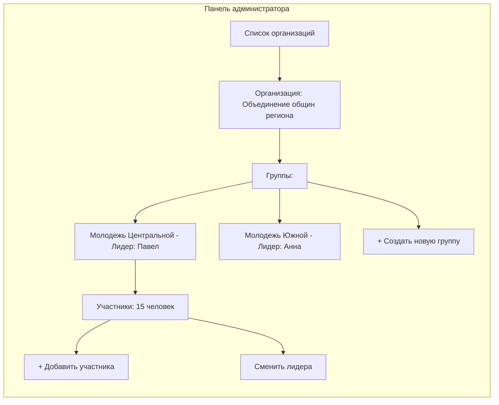

---

### 6.1 Экран "Сегодня" (Today) -- для участника

#### Назначение

Главный экран участника. Показывает задания текущего дня с текущим статусом выполнения.

#### Содержимое экрана

Список из 8 заданий на день. Каждое задание имеет свое назначение:

| # | Задание | Тип ввода | Духовная цель |
|---|---------|-----------|---------------|
| 1 | Прочитал текст (ВЗ) | Отметка | Знакомство с текстом Ветхого Завета |
| 2 | Оглавление главы | Текст | Структурирование прочитанного |
| 3 | Прочитал отрывок НЗ | Отметка | Параллельное чтение Нового Завета |
| 4 | Две мысли из текста | Текст | Размышление и анализ |
| 5 | Молитва (2-3 раза) | Счетчик | Формирование молитвенной привычки |
| 6 | Что Бог сказал мне сегодня | Текст | Личное слышание Бога |
| 7 | Пример / наблюдение | Текст | Применение текста к жизни |
| 8 | Тест | Переход к тесту | Проверка понимания |

#### Wireframe


#### Почему именно эти 8 заданий

Структура заданий построена по принципу **индуктивного изучения Библии**:

1. **Наблюдение** (задания 1-3): что написано в тексте.
2. **Толкование** (задания 4, 6): что это значит.
3. **Применение** (задания 5, 7): как это связано с моей жизнью.
4. **Проверка** (задание 8): насколько я понял.

Этот метод используется в семинариях и библейских школах по всему миру и адаптирован здесь для ежедневного использования молодежью.

---

### 6.2 Экран "Календарь" (Calendar) -- для участника

#### Назначение

Показать участнику его регулярность выполнения заданий в виде месячного календаря.

#### Цветовая система

| Цвет | Значение | Критерий |
|------|----------|----------|
| Зеленый | Все задания выполнены | 100% выполнение |
| Желтый | Частично выполнено | Часть заданий завершена |
| Красный | Задания почти не выполнены | Минимальное выполнение |

#### Wireframe


#### Взаимодействие

При нажатии на любой день открывается детальный список задач этого дня с их статусами. Это позволяет участнику вернуться к прошлым записям и перечитать свои мысли.

#### Ценность для участника

Визуализация регулярности -- мощный мотиватор. Когда участник видит полосу зеленых дней, он не хочет её прерывать. Когда видит красные дни -- понимает, что нужно вернуться к ритму. Это работает как "цепочка привычки" (habit chain), эффективность которой подтверждена множеством исследований.

---

### 6.3 Экран "Тест" (Quiz) -- для участника

#### Назначение

Проверить понимание прочитанного текста через короткий тест.

#### Процесс прохождения

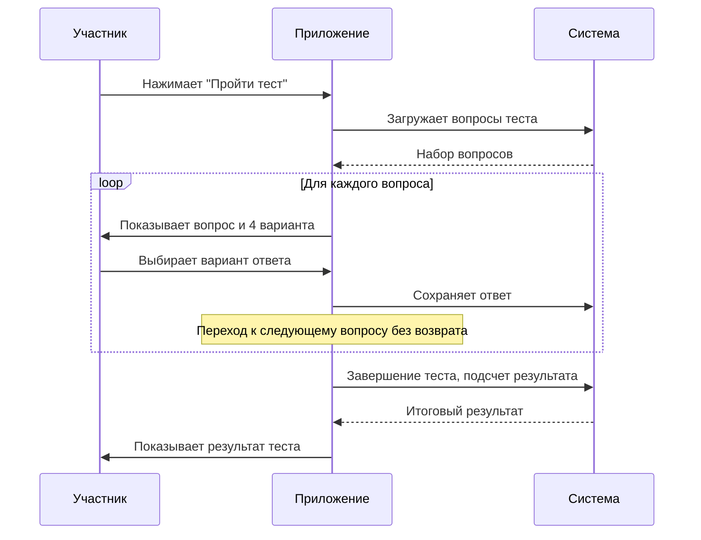

#### Ограничения

- **Одна попытка** -- тест можно пройти только один раз.
- **Без возврата** -- нельзя вернуться к предыдущему вопросу после ответа.
- **Автосохранение** -- каждый ответ сохраняется сразу после выбора.

#### Wireframe экрана вопроса


#### Ценность тестирования

Тесты -- это не экзамен. Их цель -- помочь участнику закрепить прочитанное. Когда человек отвечает на вопросы по тексту, информация запоминается значительно лучше. Это принцип активного вспоминания (active recall), один из самых эффективных методов обучения.

---

### 6.4 Редактор дня (Day Editor) -- для лидера

#### Назначение

Позволяет лидеру создать план заданий для группы на конкретную дату.

#### Возможности

- Указать текст чтения Ветхого Завета (книга, глава).
- Указать отрывок Нового Завета.
- Настроить параметры заданий (например, минимальное количество символов для текстовых ответов).
- Назначить задания на конкретную дату.

#### Wireframe


---

### 6.5 Редактор тестов (Quiz Editor) -- для лидера

#### Назначение

Позволяет лидеру создавать тесты по прочитанному тексту -- вручную или с помощью AI.

#### Два режима создания

**Ручной режим:**
- Лидер вводит вопрос.
- Добавляет 4 варианта ответа.
- Отмечает правильный ответ.
- Повторяет для каждого вопроса.

**AI-режим:**
- Лидер указывает текст.
- Система автоматически генерирует вопросы по тексту.
- Лидер проверяет, редактирует и утверждает тест.
- Публикует готовый тест.

#### Wireframe


#### Ценность AI-генерации

AI-генерация тестов значительно экономит время лидера. Вместо того чтобы вручную придумывать вопросы каждый день, лидер может сгенерировать тест за секунды и потратить освободившееся время на личное общение с молодежью.

---

### 6.6 Дашборд аналитики (Analytics) -- для лидера

#### Назначение

Дать лидеру полное понимание состояния группы: кто активен, кто отстает, какие темы вызывают трудности.

#### Основные метрики

- **Процент выполненных заданий** -- по группе в целом.
- **Цветовое состояние участников** -- зеленый/желтый/красный за сегодня.
- **Результаты тестов** -- средний балл по группе.
- **Средний процент выполнения** -- тренд по дням.

#### Аналитические показатели

| Показатель | Что показывает | Зачем нужен лидеру |
|------------|---------------|--------------------|
| Полностью закрытые дни | Сколько участников выполнили все задания | Общая оценка вовлеченности |
| Незавершенные задания | Кто не завершил задания | Выявление нуждающихся во внимании |
| Слабые задания | Какие задания выполняются хуже всего | Корректировка подхода |
| Сложные вопросы теста | Вопросы с наибольшим количеством ошибок | Выявление пробелов в понимании |

#### Wireframe


#### Ценность аналитики

Без аналитики лидер работает вслепую. С аналитикой -- он видит объективную картину и может:

- Обратить внимание на тех, кто тихо отдаляется.
- Увидеть, что определенные темы сложны для группы.
- Отслеживать динамику: группа растет или теряет вовлеченность.

Это превращает субъективное "мне кажется, все нормально" в объективные данные.

---

### 6.7 Панель администратора

#### Назначение

Управление организационной структурой: организации, группы, пользователи.

#### Возможности

- **Создание организаций** -- например, объединение общин.
- **Создание групп** -- молодежные группы внутри организации.
- **Назначение лидеров** -- привязка лидера к группе.
- **Добавление участников** -- включение молодых людей в группы.
- **Управление часовыми поясами** -- для групп в разных регионах.

#### Wireframe

```mermaid
flowchart TD
    subgraph admin_panel [Панель администратора]
        direction TB
        OrgList["Список организаций"]
        OrgList --> OrgDetail["Организация: Объединение общин региона"]
        OrgDetail --> GroupList["Группы:"]
        GroupList --> Grp1["Молодежь Центральной - Лидер: Павел"]
        GroupList --> Grp2["Молодежь Южной - Лидер: Анна"]
        GroupList --> AddGroup["+ Создать новую группу"]

        Grp1 --> Members["Участники: 15 человек"]
        Members --> AddMember["+ Добавить участника"]
        Members --> ChangeLead["Сменить лидера"]
    end
```

---

## 7. Ежедневный отчет лидеру (Daily Digest)

### Назначение

Каждый день лидер автоматически получает краткую сводку по своей группе. Это позволяет быть в курсе без необходимости заходить в приложение и проверять каждого участника вручную.

### Содержимое отчета

**1. Общая статистика группы:**
- Количество активных участников.
- Распределение по цветам: сколько зеленых, желтых, красных дней.

**2. Сигналы внимания:**
- Участники с низким прогрессом.
- Участники, не прошедшие тест.
- Участники, отсутствующие несколько дней подряд.

**3. Аналитические выводы:**
- Вопросы теста, на которых ошибаются чаще всего.
- Задания, которые выполняются хуже всего (например, текстовые задания пропускаются чаще).

### Каналы доставки

| Канал | Описание |
|-------|----------|
| **Email** | Отчет приходит на электронную почту лидера |
| **Telegram** | Отчет приходит в Telegram-бот |

Лидер может выбрать удобный канал или использовать оба.

### Процесс формирования отчета

```mermaid
flowchart LR
    A[Конец дня] --> B[Система собирает данные по группе]
    B --> C[Формируется отчет]
    C --> D{Каналы доставки}
    D -->|Email| E[Отправка на почту]
    D -->|Telegram| F[Отправка в Telegram]
    E --> G[Лидер получает отчет]
    F --> G
    G --> H[Лидер принимает решение о поддержке]
```

### Ценность Daily Digest

Daily Digest -- это "пульс" группы. Лидер, даже в самый загруженный день, потратив 2 минуты на чтение отчета, будет знать:

- Всё ли в порядке с группой.
- Кому нужно уделить внимание.
- Есть ли проблемы с пониманием материала.

Это превращает спорадическую заботу в **системную пасторскую работу**.

---

## 8. Полный цикл одного дня в системе

Ниже представлена диаграмма, показывающая все взаимодействия в системе в течение одного дня:

```mermaid
sequenceDiagram
    participant Leader as Лидер
    participant System as Система
    participant Student as Участник
    participant Digest as Daily Digest

    Note over Leader: Утро / подготовка
    Leader->>System: Создает план дня (текст ВЗ, НЗ, настройки)
    Leader->>System: Создает тест (вручную или через AI)
    Leader->>System: Публикует тест
    System-->>Student: Уведомление: задания на сегодня готовы

    Note over Student: В течение дня
    Student->>System: Открывает экран Today
    Student->>System: Читает текст ВЗ, отмечает выполнение
    Student->>System: Записывает оглавление главы
    Student->>System: Читает отрывок НЗ
    Student->>System: Записывает две мысли
    Student->>System: Отмечает молитву
    Student->>System: Записывает что Бог сказал
    Student->>System: Записывает пример
    Student->>System: Проходит тест

    System->>System: Вычисляет прогресс и цвет дня
    System-->>Student: Обновляет статус в календаре

    Note over Digest: Конец дня
    System->>Digest: Собирает данные по всем участникам
    Digest->>Leader: Отправляет отчет (email / Telegram)

    Note over Leader: Вечер / реакция
    Leader->>Leader: Анализирует отчет
    Leader->>Student: При необходимости поддерживает лично
```

---

## 9. Принципы использования системы

Система создается на основе четырех ключевых принципов, которые определяют все решения в дизайне и функционале:

### Принцип 1: Помощь, а не оценка

Система не ставит оценок и не создает рейтингов. Цветовая индикация -- это обратная связь для самого участника, а не публичная оценка. Цель -- помочь увидеть свою регулярность, а не сравнивать себя с другими.

### Принцип 2: Регулярность, а не идеальность

Система ценит постоянство больше, чем идеальное выполнение. Желтый день лучше, чем пропущенный день. Даже одно выполненное задание -- это шаг вперед. Система не наказывает за неидеальность.

### Принцип 3: Поддержка, а не критика

Данные аналитики и Daily Digest предназначены для заботы, а не для критики. Лидер использует информацию, чтобы **поддержать**, позвонить, ободрить -- а не чтобы публично указать на недостатки.

### Принцип 4: Личное развитие в общении с Богом

В центре системы -- личные отношения участника с Богом. Приложение лишь создает структуру и ритм, но содержание -- это живое взаимодействие человека со Словом Божьим. Технология служит духовному росту, а не заменяет его.

---

## 10. Ожидаемые результаты внедрения

### Для участников (молодежь)

- Повышение регулярности чтения Библии.
- Формирование привычки ежедневного размышления над Словом.
- Более осмысленное отношение к прочитанному.
- Накопление личного архива духовных наблюдений.
- Ощущение поддержки и принадлежности к группе.

### Для лидеров

- Объективная картина состояния группы.
- Экономия времени на рутинном контроле.
- Возможность вовремя поддержать нуждающихся.
- Понимание трудностей группы в изучении текста.
- Инструмент для системной пасторской работы.

### Для церкви в целом

- Вовлеченная и растущая молодежь.
- Молодые люди, умеющие самостоятельно изучать Библию.
- Укрепление отношений между лидерами и молодежью.
- Формирование культуры духовной дисциплины без давления.
- Масштабируемый инструмент: подходит для одной группы или целого объединения общин.

---

*Документ подготовлен как полное описание функционала и ценности системы ежедневных библейских активностей для христианской молодежи.*
